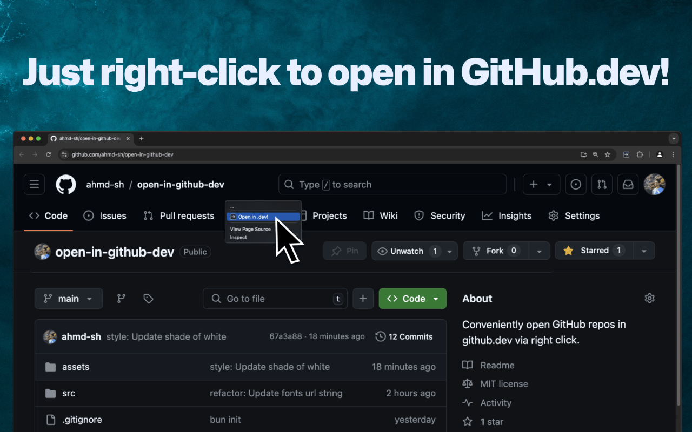
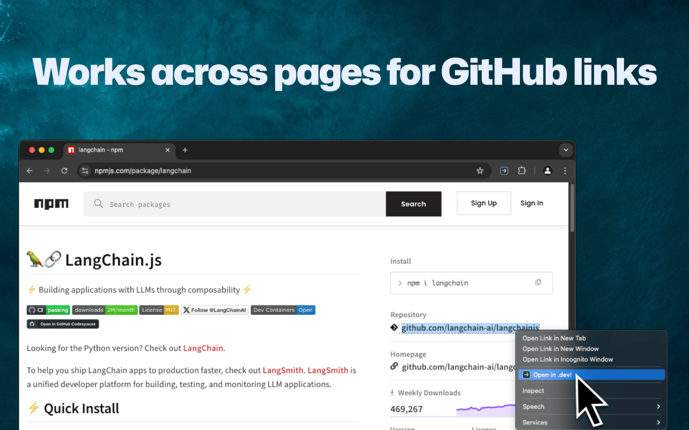

# Open in (GitHub) Dev!

Quickly open GitHub repos in GitHub.dev via right-click.

### Screenshots

<h3 align="center"></h3>

<h3 align="center"></h3>

## Setup

### 1. Clone the Repository
First, clone the repository to your local machine. For example:

```bash
git clone https://github.com/ahmd-sh/open-in-github-dev.git
cd open-in-github-dev
```

### 2. Install Dependencies
You'll need [Bun](https://bun.sh/) installed on your system to manage dependencies and run the build process. If you don't have Bun installed yet, you can follow the instructions [here](https://bun.sh/docs/installation).

After installing Bun, install the project dependencies by running:

```bash
bun install
```

You'll also need [web-ext](https://extensionworkshop.com/documentation/develop/web-ext-command-reference/) installed on your system to build the extension into an optimized .zip file. You can follow the instructions [here](https://extensionworkshop.com/documentation/develop/getting-started-with-web-ext/).

### 3. Development Mode
To start the development mode with auto-reloading for a specific browser (Chrome or Firefox):

- **Chrome**:
  
  ```bash
  bun run dev:chrome
  ```

- **Firefox**:
  
  ```bash
  bun run dev:firefox
  ```

This will watch your source files and build the output to `dist/index.js`, while also generating the appropriate `manifest.json` for the target browser.

### 4. Building the Extension
To create a production build for a specific browser, run one of the following commands:

- **Chrome**:
  
  ```bash
  bun run build:chrome
  ```

- **Firefox**:
  
  ```bash
  bun run build:firefox
  ```

This will generate the corresponding `manifest.json` for the chosen browser and compress relevant files to `build/`.

### IMPORTANT

The generate manifests script in `manifest/` and the build script in `build-scripts/` use forward slashes for file paths, which may not work on Windows and similar operating systems. Only Unix-like systems (MacOS, Linux, etc.) are supported as of now.
